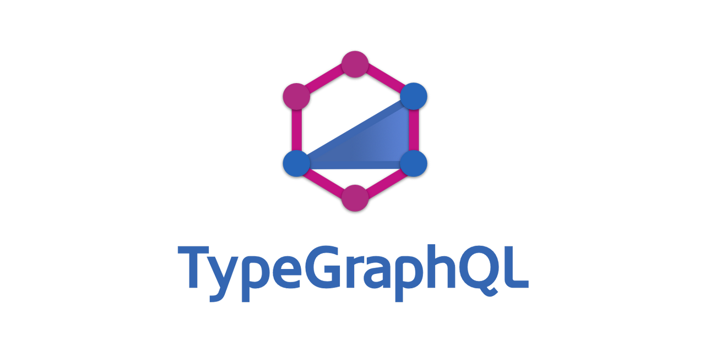

  
  
  
  
  
  

## About

This is a personal playground to learn the TypeGraphQL Framework, connected to MongoDB Atlas database using Typegoose library.

## Author

👤 **Elizeu Louzeiro**

- Twitter: [@elizeumatheus\_](https://twitter.com/elizeumatheus_)
- Github: [@elizeumatheus](https://github.com/elizeumatheus)
- LinkedIn: [@elizeulouzeiro](https://linkedin.com/in/elizeulouzeiro)

## Show your support

Give a ⭐️ if this project helped you!

---

_This README was generated with ❤️ by [readme-md-generator](https://github.com/kefranabg/readme-md-generator)_
